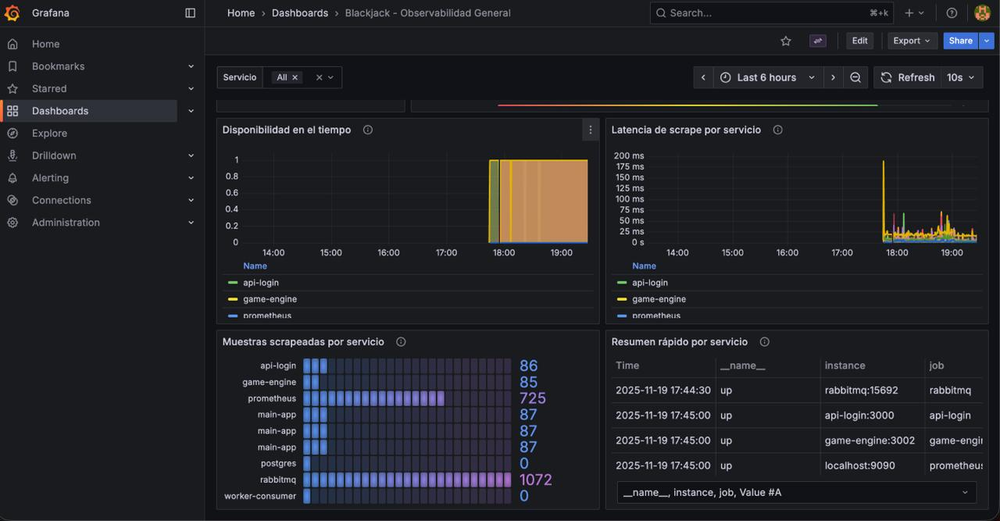
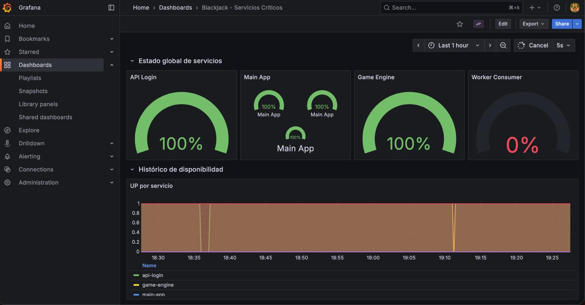
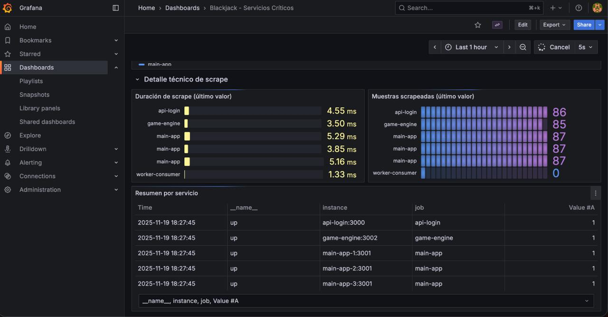
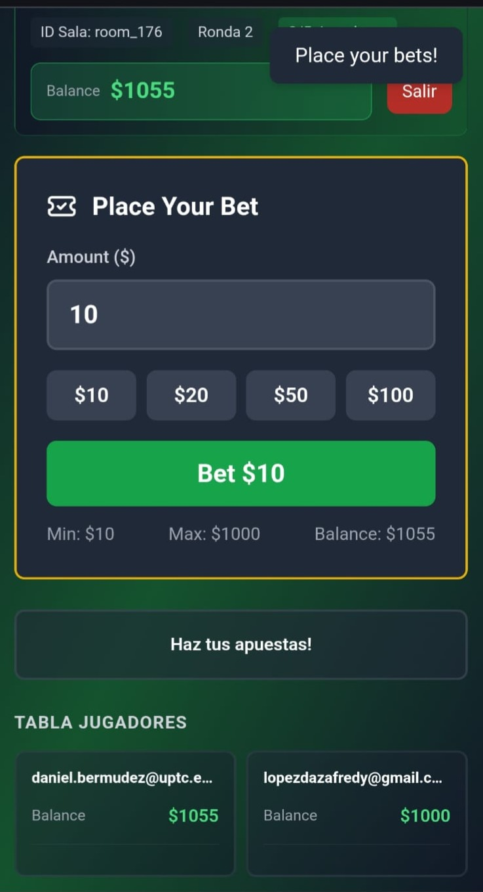
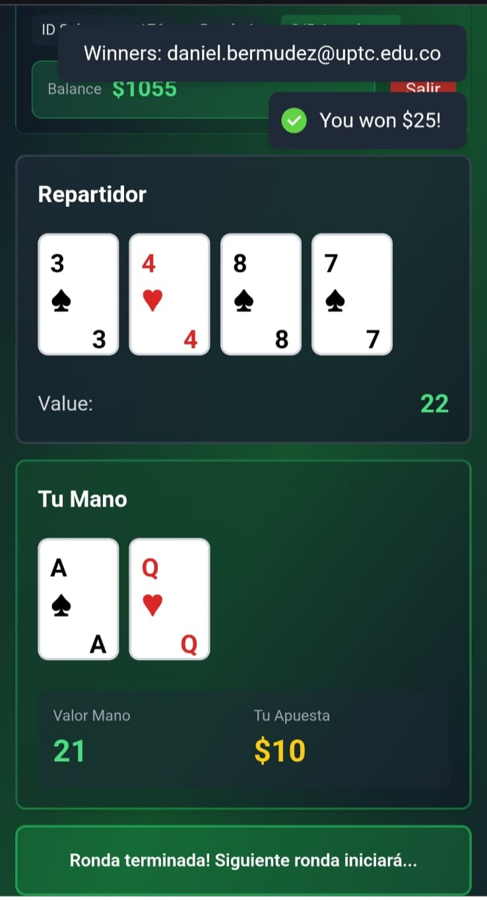
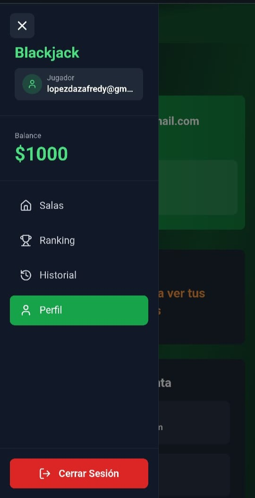

# 🎰 Blackjack Distribuido - Sistema de Alta Disponibilidad

Sistema de juego Blackjack multijugador con arquitectura distribuida, diseñado para garantizar alta disponibilidad, tolerancia a fallos y escalabilidad horizontal.

[](https://opensource.org/licenses/MIT)
[](https://nodejs.org/)
[](https://www.docker.com/)

---

## 📋 Tabla de Contenidos

- [Características Principales](#-características-principales)
- [Arquitectura del Sistema](#-arquitectura-del-sistema)
- [Tecnologías Utilizadas](#-tecnologías-utilizadas)
- [Requisitos Previos](#-requisitos-previos)
- [Instalación y Configuración](#-instalación-y-configuración)
- [Despliegue](#-despliegue)
- [Monitoreo y Observabilidad](#-monitoreo-y-observabilidad)
- [Estructura del Proyecto](#-estructura-del-proyecto)
- [Capturas de Pantalla](#-capturas-de-pantalla)
- [Equipo de Desarrollo](#-equipo-de-desarrollo)
- [Licencia](#-licencia)

---

## Características Principales

### 🎮 Funcionalidades de Juego
- **Blackjack Multiplayer en Tiempo Real** con hasta 7 jugadores por sala
- **Salas Públicas y Privadas** con protección por contraseña.
- **Sistema de Apuestas Configurable** (mínimo/máximo por sala)
- **Múltiples Mazos** (6 barajas estándar con shuffle automático)
- **Comunicación WebSocket** para actualizaciones en tiempo real

### 🔐 Sistema de Autenticación
- **Login/Registro** con validación robusta
- **JWT Token** con expiración configurable (24h)
- **Recuperación de Contraseña** mediante email con tokens temporales
- **Roles de Usuario** (user, admin, moderator, service)
- **Bloqueo de Cuenta** tras 5 intentos fallidos (15 minutos)
- **Cambio de Contraseña** dentro de la aplicación

### 💰 Sistema de Pagos
- **Integración con ePayco** para recargas de balance
- **Modo Mock** para desarrollo sin conexión real
- **Webhook de Confirmación** para actualización automática de saldos
- **Conversión COP/USD** automática

### 📊 Estadísticas y Rankings
- **Ranking Global** ordenado por ganancias totales
- **Estadísticas Personales** (partidas jugadas, ganadas, win rate)
- **Historial de Partidas** con detalles completos
- **Sistema de Logros** desbloqueables

### 🛡️ Alta Disponibilidad
- **Modo Degradado** cuando PostgreSQL de main-app está caído.
- **Réplicas del Main App** (3 instancias con load balancing)
- **Fallback a Game Engine** para datos en memoria
- **Cola de Mensajes** (RabbitMQ) para escrituras pendientes
- **Worker Consumer** que procesa operaciones cuando la BD se recupera
- **Health Checks** automáticos con Prometheus

### 🔍 Observabilidad
- **Prometheus** para recolección de métricas
- **Grafana** con dashboards pre-configurados
- **Logs Centralizados** con Winston
- **Métricas de Negocio** (jugadores activos, partidas, etc.)

---

## Arquitectura del Sistema


### Flujo de Datos

1. **Usuario accede al Frontend** → NGINX redirige a React App
2. **Login/Registro** → API Login valida credenciales → Devuelve JWT
3. **Usuario crea sala** → Main App guarda en PostgreSQL → Notifica a Game Engine
4. **Usuario se une a sala** → WebSocket conecta con Game Engine
5. **Juego en progreso** → Game Engine gestiona estado → Actualiza vía WebSocket
6. **Ronda termina** → Game Engine guarda en su BD → Sincroniza con Main App
7. **Main App actualiza rankings** → Worker Consumer procesa colas si hubo fallos

### Tolerancia a Fallos

- **PostgreSQL caído**: Sistema entra en **modo degradado**
  - Salas se crean solo en Game Engine (memoria)
  - Operaciones se encolan en RabbitMQ
  - Worker Consumer las procesa cuando la BD se recupera
  - Rankings/historial se obtienen desde Game Engine

- **Game Engine caído**: 
  - No se pueden crear nuevas partidas
  - Partidas en curso se pierden (limitación actual)

- **RabbitMQ caído**:
  - No se pueden encolar operaciones
  - Sistema funciona en modo normal si PostgreSQL está up

---

## Tecnologías Utilizadas

### Backend
- **Node.js 20** - Runtime de JavaScript
- **Express.js** - Framework web
- **Prisma** - ORM para PostgreSQL
- **Socket.IO** - Comunicación WebSocket en tiempo real
- **JWT** - Autenticación basada en tokens
- **bcrypt** - Hash de contraseñas
- **Nodemailer** - Envío de emails
- **axios** - Cliente HTTP
- **amqplib** - Cliente RabbitMQ
- **Winston** - Logging estructurado

### Frontend
- **React 18** - Biblioteca UI
- **TypeScript** - Tipado estático
- **Vite** - Build tool
- **React Router** - Enrutamiento
- **Zustand** - State management
- **Socket.IO Client** - WebSocket client
- **Tailwind CSS** - Estilos utility-first
- **React Hot Toast** - Notificaciones
- **Lucide React** - Iconos

### Infraestructura
- **Docker & Docker Compose** - Contenedorización
- **NGINX** - Reverse proxy y load balancer
- **PostgreSQL 16** - Base de datos relacional
- **RabbitMQ 3.13** - Message broker
- **Prometheus** - Recolección de métricas
- **Grafana** - Visualización de métricas

---

## Requisitos Previos

- **Docker** >= 20.10
- **Docker Compose** >= 2.0
- **Git**
- **Node.js 20** (solo para desarrollo local)
- **Cuenta ePayco** (opcional, para pagos en producción)

---

## Instalación y Configuración

### 1. Clonar el Repositorio

```bash
git clone https://github.com/fredylopez01/blackjack
cd blackjack
```

### 2. Configurar Variables de Entorno

Crear archivo `.env` en la raíz del proyecto, guia ``.env.example``

### 3. Configurar Email (Gmail)

Para el envío de emails de recuperación de contraseña:

1. Ve a tu cuenta de Gmail
2. Activa la verificación en 2 pasos
3. Genera una **Contraseña de Aplicación**:
   - Ve a: https://myaccount.google.com/apppasswords
   - Genera una contraseña para "Otra (Nombre personalizado)"
4. Usa esta contraseña en `EMAIL_PASS`

---

## Despliegue

### Opción 1: Docker Compose (Recomendado)

```bash
# Dar permisos de ejecución al script
chmod +x deploy.sh

# Ejecutar despliegue
./deploy.sh
```

El script automáticamente:
- Verifica archivos necesarios
- Detiene contenedores existentes
- Limpia imágenes antiguas
- Construye imágenes Docker
- Inicia todos los servicios
- Muestra logs iniciales
- Presenta resumen de servicios disponibles

### Opción 2: Manual con Docker Compose

```bash
# Construir imágenes
docker-compose build

# Iniciar servicios
docker-compose up -d

# Ver logs
docker-compose logs -f

# Ver estado de servicios
docker-compose ps
```

### Opción 3: Desarrollo Local (Sin Docker)

---

## Monitoreo y Observabilidad

### Servicios Disponibles

Una vez desplegado, accede a:

| Servicio | URL | Credenciales |
|----------|-----|--------------|
| **Frontend** | http://localhost | - |
| **API Login** | http://localhost:3000 | - |
| **Main App** | http://localhost/api | - |
| **Game Engine** | http://localhost:3002 | - |
| **RabbitMQ Admin** | http://localhost:15672 | admin / admin123 |
| **Prometheus** | http://localhost:9090 | - |
| **Grafana** | http://localhost:3010 | admin / admin123 |

### Dashboards de Grafana

El sistema incluye 2 dashboards pre-configurados:

#### 1. **Blackjack - Observabilidad General**
- Estado UP/DOWN de todos los servicios
- Latencia de scrape por servicio
- Número de métricas recolectadas
- Vista de tabla con resumen rápido




#### 2. **Blackjack - Servicios Críticos**
- Gauges de disponibilidad por servicio (API Login, Main App, Game Engine, Worker)
- Histórico de disponibilidad
- Duración de scrape
- Muestras scrapeadas




### Métricas Disponibles

El sistema expone métricas en `/metrics` de cada servicio:

- `up` - Estado del servicio (1 = up, 0 = down)
- `scrape_duration_seconds` - Tiempo de recolección
- `scrape_samples_scraped` - Número de métricas
- `nodejs_heap_size_used_bytes` - Uso de memoria
- `process_cpu_seconds_total` - Uso de CPU
- Y más métricas estándar de Node.js

### Logs

Los logs se almacenan en:
- **Contenedor**: `docker-compose logs -f [servicio]`
- **Archivos**: `[servicio]/logs/*.log`

---

## Estructura del Proyecto

```
blackjack-distribuido/
│
├── api-login-distribuidos/       # Servicio de Autenticación
│   ├── src/
│   │   ├── controllers/          # Lógica de negocio
│   │   ├── middleware/           # Auth, logging, validación
│   │   ├── models/               # Modelos de datos
│   │   ├── routes/               # Definición de rutas
│   │   ├── services/             # Servicios externos (email, encriptación)
│   │   └── utils/                # Utilidades
│   ├── data/                     # Persistencia en JSON
│   │   ├── users.json
│   │   └── reset_tokens.json
│   ├── docs/                     # Documentación Swagger
│   ├── Dockerfile
│   └── package.json
│
├── main-app/                     # Orquestador del Sistema
│   ├── src/
│   │   ├── controllers/          # Lógica de salas, rankings, historial
│   │   ├── middleware/           # Auth, health check, error handling
│   │   ├── routes/               # Rutas REST
│   │   ├── services/             # RabbitMQ, sincronización
│   │   └── utils/                # JWT, logger
│   ├── prisma/
│   │   ├── schema.prisma         # Esquema de base de datos
│   │   └── migrations/           # Migraciones SQL
│   ├── Dockerfile
│   └── package.json
│
├── game-engine/                  # Motor de Juego Blackjack
│   ├── src/
│   │   ├── game/                 # Lógica del juego
│   │   │   ├── BlackjackGame.js  # Clase principal del juego
│   │   │   ├── Deck.js           # Mazo de cartas
│   │   │   └── GameManager.js    # Gestor de partidas
│   │   ├── socket/               # Handlers WebSocket
│   │   ├── services/             # RabbitMQ, sincronización
│   │   ├── routes/               # Rutas internas
│   │   └── utils/                # Logger
│   ├── prisma/
│   │   └── schema.prisma         # BD de partidas
│   ├── tests/                    # Tests unitarios
│   ├── Dockerfile
│   └── package.json
│
├── worker-consumer/              # Procesador de Colas
│   ├── index.js                  # Consumer de RabbitMQ
│   ├── prisma/
│   │   └── schema.prisma         # Mismo schema que Main App
│   ├── utils/
│   │   └── logger.js
│   ├── Dockerfile
│   └── package.json
│
├── frontend/                     # Aplicación React
│   ├── src/
│   │   ├── components/           # Componentes reutilizables
│   │   ├── pages/                # Páginas (Login, Lobby, Game, etc.)
│   │   ├── services/             # API client, WebSocket
│   │   ├── store/                # Zustand stores
│   │   ├── interfaces/           # TypeScript interfaces
│   │   └── utils/                # Utilidades
│   ├── public/                   # Assets estáticos
│   ├── Dockerfile
│   ├── nginx.conf                # Config de NGINX interno
│   └── package.json
│
├── nginx/                        # Reverse Proxy Principal
│   └── nginx.conf                # Configuración de load balancing
│
├── grafana/                      # Configuración de Grafana
│   └── provisioning/
│       ├── datasources/          # Prometheus datasource
│       └── dashboards/           # Dashboards JSON
│
├── docker-compose.yml            # Orquestación de servicios
├── prometheus.yml                # Configuración de Prometheus
├── init-postgres.sh              # Script de inicialización de BD
├── deploy.sh                     # Script de despliegue
└── README.md                     # Este archivo
```

---

## Capturas de Pantalla

<div style="display: flex; gap: 10px; justify-content: center;">
    
    
    
</div>

---

## Pruebas

### Tests Unitarios (Game Engine)

```bash
cd game-engine
npm test
```

Tests disponibles:
- ✅ Agregar/remover jugadores
- ✅ Iniciar fase de apuestas
- ✅ Validación de apuestas
- ✅ Flujo completo de ronda

### Pruebas de Integración

```bash
# Probar creación de sala
curl -X POST http://localhost/api/rooms \
  -H "Authorization: Bearer YOUR_JWT" \
  -H "Content-Type: application/json" \
  -d '{"name":"Test Room","maxPlayers":5,"minBet":10,"maxBet":1000}'

# Probar health checks
curl http://localhost/health
curl http://localhost:3000/health
curl http://localhost:3002/health
```

### Pruebas de Tolerancia a Fallos

**Simular caída de PostgreSQL:**
```bash
docker-compose stop postgres

# El sistema debe entrar en modo degradado
# Crear una sala y verificar que se encola
curl -X POST http://localhost/api/rooms ...

# Verificar en RabbitMQ que hay mensajes en pending-writes
# Abrir: http://localhost:15672

# Restaurar PostgreSQL
docker-compose start postgres

# Worker Consumer debe procesar los mensajes encolados
docker-compose logs -f worker-consumer
```

---

## Equipo de Desarrollo

### Desarrolladores

- **Fredy López**
  - Arquitectura distribuida
  - Configuración de repositorio
  - Game Engine (lógica de Blackjack)
  - WebSocket real-time
  - Frontend React/TypeScript
  - Sistema de logs
  - Sistema de tolerancia a fallos
  - Documentación técnica
  - GitHub: [@fredylopez01](https://github.com/fredylopez01)

- **David Rodriguez**
  - Registro de usuarios y gestión de roles
  - Sistema de recuperación de contraseñas
  - Servicios de email
  - Validaciones y middleware

- **Santiago Naranjo**
  - Sistema de login con JWT
  - Test unitarios y pruebas

### Institución

**Universidad Pedagógica y Tecnológica de Colombia (UPTC)**  
Facultad de Ingeniería  
Ingeniería de Sistemas y Computación  
Tunja, Colombia

### Materia

**Sistemas Distribuidos**  
2024-2

---

## Roadmap y Mejoras Futuras

- [ ] **Persistencia de partidas activas** (Redis)
- [ ] **Chat en tiempo real** entre jugadores
- [ ] **Espectadores** en salas públicas
- [ ] **Torneos** con premios
- [ ] **Sistema de amigos** y mensajes privados
- [ ] **Modo "Double Down"** y "Split"
- [ ] **Leaderboard semanal/mensual**
- [ ] **Notificaciones push** (Web Push API)
- [ ] **Internacionalización** (i18n)
- [ ] **Modo oscuro/claro**
- [ ] **Tests E2E** con Cypress
- [ ] **CI/CD** con GitHub Actions
- [ ] **Kubernetes** para orquestación en producción

---

## Contribuciones

Las contribuciones son bienvenidas. Por favor:

1. Fork el proyecto
2. Crea una rama para tu feature (`git checkout -b feature/AmazingFeature`)
3. Commit tus cambios (`git commit -m 'Add some AmazingFeature'`)
4. Push a la rama (`git push origin feature/AmazingFeature`)
5. Abre un Pull Request

### Convenciones de Commits

```
tipo(scope): descripción corta

[opcional] descripción más detallada
```

**Tipos válidos:**
- `feat`: nueva funcionalidad
- `fix`: corrección de bug
- `docs`: cambios en documentación
- `refactor`: reestructuración sin cambiar funcionalidad
- `test`: pruebas
- `chore`: tareas de mantenimiento

---

## Licencia

Este proyecto está bajo la Licencia MIT. Ver el archivo [LICENSE](LICENSE) para más detalles.

---

## Contacto y Soporte

Para preguntas, sugerencias o reportar problemas:

- **Email**: lopezdazafredy@gmail.com
- **Issues GitHub**: [Crear un Issue](https://github.com/fredylopez01/api-login-distribuidos/issues/new)

---

## Contexto Académico

Este proyecto fue desarrollado como trabajo final para la materia de **Sistemas Distribuidos** en la **Universidad Pedagógica y Tecnológica de Colombia (UPTC)**.

### Objetivos de Aprendizaje Cumplidos

- **Alta Disponibilidad**: Sistema funcional incluso con caídas de servicios  
- **Tolerancia a Fallos**: Recuperación automática mediante colas de mensajes  
- **Escalabilidad Horizontal**: Réplicas del Main App con load balancing  
- **Comunicación Asíncrona**: Uso de RabbitMQ para desacoplamiento  
- **Monitoreo y Observabilidad**: Prometheus + Grafana para métricas en tiempo real  
**Microservicios**: Arquitectura distribuida con servicios independientes  
- **Consistencia Eventual**: Sincronización de datos entre servicios  
- **WebSocket Real-Time**: Comunicación bidireccional para juego en tiempo real

---

## Agradecimientos

- **Profesor de Sistemas Distribuidos** - Por la guía y conocimientos compartidos
- **Universidad UPTC** - Por la formación académica
- **Comunidad Open Source** - Por las herramientas y librerías utilizadas
- **Compañeros de clase** - Por el feedback y pruebas del sistema